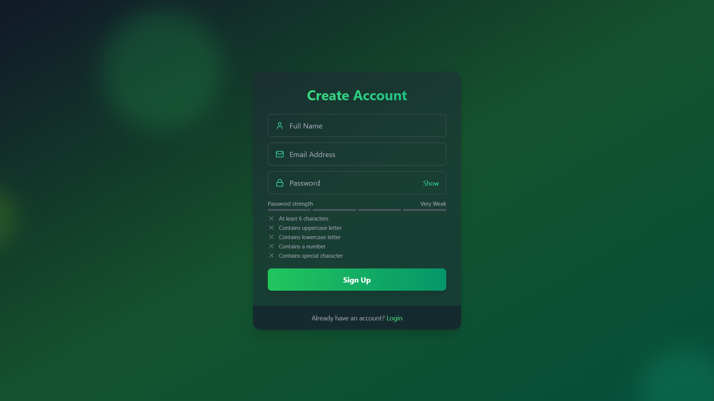
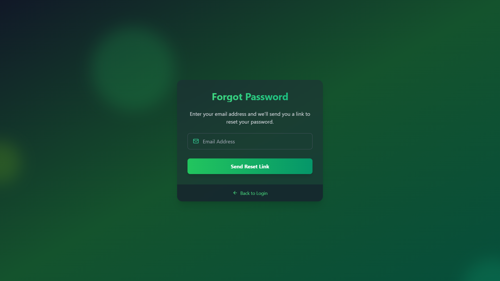
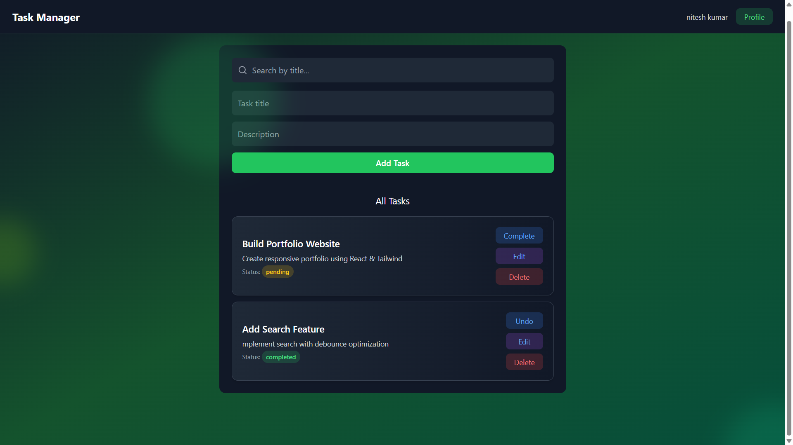

# 🔐Task Management Web Application


A **secure, scalable, and production-ready MERN Authentication System** built using **MongoDB, Express.js, React (Vite), and Node.js**.

This project implements real-world authentication workflows including:

- 🔐 **Email Verification (OTP)**
- 🔑 **Secure Login & Signup**
- 🔄 **Password Reset Flow**
- 🛡️ **Protected Routes**
- 🍪 **JWT Authentication using HTTP-only cookies**

---

## 📋 Task Management Features

- **Add Tasks:** Create new tasks with title and description  
-  **Update Tasks:** Edit task details and update status  
-  **Delete Tasks:** Remove tasks instantly  
-  **Toggle Status:** Mark tasks as **completed / pending**  
-  **Search Tasks:** Filter tasks by title in real-time  
-  **Filter Tasks:** View tasks by:
  - All Tasks  
  - Completed Tasks  
  - Pending Tasks  
- **Task Statistics Dashboard**

---

Designed with **best security practices**, clean architecture, and optimized performance for real-world applications.


## 🌐 Live Demo

🚀 **[View Live Project](https://mern-auth-system-s4kj.onrender.com)**

_Deployed on Render with environment-based configuration._

---


## 📸 Screenshots


### 🔐 Login Page
<p align="center">
  
</p>
<p align="center"><i>Secure login interface with validation and authentication.</i></p>

---

### 📝 Signup Page
<p align="center">
  
</p>
<p align="center"><i>Create a new account with email verification.</i></p>

---

### 🔑 Forgot Password Page
<p align="center">
  
</p>
<p align="center"><i>Reset your password securely via email.</i></p>

---

### 🏠 Dashboard Page
<p align="center">
  
</p>
<p align="center"><i>Manage tasks efficiently with search, filters, and task actions.</i></p>


## ✨ Features

###  🔑 Authentication

### Frontend
- **Modern UI/UX:** Built with **React** and styled with **Tailwind CSS**.
- **Animations:** Smooth background and component animations using **Framer Motion**.
- **State Management:** Global auth state management using **Zustand**.
- **Routing:** Protected routes using **React Router v7**.
- **Notifications:** Real-time toast notifications with **React Hot Toast**.
- **Interactive Components:**
  - Password Strength Meter.
  - Floating Shape Backgrounds.
  - Loading Spinners.


### Backend
- **Security:**
  - **JWT (JSON Web Tokens)** for secure authentication.
  - **Bcrypt** for password hashing.
  - **Cookie-Parser** for HTTP-only cookie management.
- **Email Services:** Integrated support for sending emails (Verification OTPs, Welcome emails, Password Reset links) using **Nodemailer**.
- **Database:** **MongoDB** with Mongoose schemas.
- **API Security:** CORS configuration and modular route handling.


---


## 🛠 Tech Stack

### Frontend
| Technology | Purpose |
| :--- | :--- |
| **React (Vite)** | Fast UI Library & Build Tool |
| **Tailwind CSS** | Utility-first Styling |
| **Framer Motion** | Complex Animations |
| **Zustand** | Global State Management |
| **Lucide React** | Iconography |
| **Axios** | HTTP Requests |

### Backend
| Technology | Purpose |
| :--- | :--- |
| **Node.js** | Runtime Environment |
| **Express.js** | REST API Framework |
| **MongoDB** | NoSQL Database |
| **Mongoose** | ODM for MongoDB |
| **JWT** | Stateless Authentication |
| **Nodemailer** | Email Transporter |

---

##  📁 Folder Structure
```bash
├── backend/
│   ├── controllers/    # Request handlers (Auth logic)
│   ├── db/             # Database connection configuration
│   ├── middleware/     # Route protection (verifyToken)
│   ├── models/         # Mongoose Models (User Schema)
│   ├── routes/         # API Routes definitions
│   ├── utils/          # Helpers (generateToken, sendEmail)
│   └── server.js       # App entry point
│
└── frontend/
    ├── src/
    │   ├── components/ # Reusable UI (Inputs, Buttons)
    │   ├── pages/      # Views (Login, Dashboard, Signup)
    │   ├── store/      # Zustand Auth Store
    │   ├── utils/      # Formatting helpers
    │   ├── App.jsx     # Main Component
    │   └── main.jsx    # DOM Entry

```

---


## 🔐 Environment Variables

### 1. Frontend 

```env
VITE_BACKEND_URL=your_backend_url
``` 

### 2. Backend 

```env
PORT=4000
NODE_ENV=production
MONGODB_URL=your_mongodb_url
JWT_SECRET=your_jwt_secret
JWT_EXPIRES_IN=7d
CLIENT_URL=your_frontend_url
BREVO_API_KEY=your_brevo_api_key
BREVO_SENDER_EMAIL=your_sender_email
BREVO_SENDER_NAME=Your_App_Name
```


---

### ⚙️ Installation & Setup
git clone: 
**[https://github.com/nitesh-kumar864/MERN_Auth](https://github.com/nitesh-kumar864/MERN_Auth)**
```bash
cd MERN_Auth
```
### Install Dependencies

## ▶️ 1️⃣ Frontend Setup & Run 
```bash
cd frontend
npm install
npm run dev
```

## ⚙️ 2️⃣ Backend Setup & Start

```bash
cd Backend
npm install
nodemon server.js
```
---

## 🔮 Future Features
- OAuth login (Google)
- login with LinkedIn
---

## 👨‍💻 Author

**Nitesh Kumar**  
GitHub: https://github.com/nitesh-kumar864
